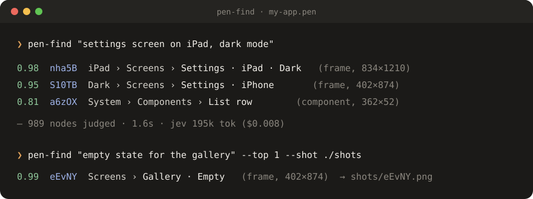
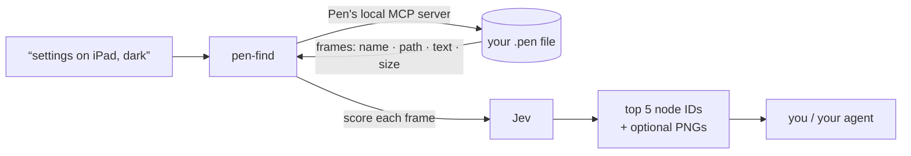

<div align="center">

# pen-find

**Find any frame in a [Pen](https://pen.dev) design file by describing it.**

[](https://www.npmjs.com/package/pen-find)
[](#install)
[](LICENSE)




</div>

Big design files have thousands of nodes. When an AI agent needs "the settings screen, dark mode" it usually
reads the whole tree to find it, which is slow and burns tokens. **pen-find** asks Pen for the node list itself,
lets [Jev](https://console.typesafe.ai) (a fast judgment model) score every frame against your words, and hands
your agent only the top few node IDs. About 2 seconds and under a cent per search.

## How it works



- **Indexes** every frame, group and component instance: its name, where it sits (board › section › …), its
  size, and the text inside it. The index is cached per file and rebuilt when the file changes.
- **Ranks** by meaning, not keywords: "the toast with Undo" finds a `Toast` component whose text says "Undo".
- **Describes frames that have no text**, too: the components and icons inside them ("Finger ring ×3,
  Pour point"), their background (light, dark, or the design's colour name), images, and device shape
  (phone or tablet screen). So "screen with three finger rings" finds a text-less canvas.
- **Returns** node IDs you can pass straight to Pen's tools, and `--shot` exports PNGs of the matches.
- **Says when it's guessing.** If nothing clearly matches, it prints `no confident match`, lists the closest
  frames marked `?`, and saves small thumbnails of them, so you (or a vision model like Claude) can pick by eye.

## Install

**As a Claude Code plugin**

```
/plugin marketplace add adelghaenian/pen-find
/plugin install pen-find@pen-find
```

**Or with npx** (CLI, and installs the Claude Code skill)

```bash
npx pen-find install
```

Then add your Jev key once. Get one at [console.typesafe.ai](https://console.typesafe.ai):

```bash
npx pen-find setup        # input is hidden; saved to ~/.pen-find/config.json (owner-only)
```

`JEV_API_KEY` in the environment works too. Requirements: macOS, the Pen desktop app open, Node 18+.

## Use

```bash
pen-find "<what you're looking for>"
```

| Flag | What it does |
| --- | --- |
| `--top 5` | how many matches to return |
| `--file x.pen` | search this file (default: the one open in Pen, else the last one used) |
| `--deep` | judge every node, not just screens and their main parts |
| `--shot DIR` | export a PNG of each match |
| `--json` | machine-readable output |
| `--refresh` | rebuild the index (after edits Pen hasn't saved yet) |
| `--no-fallback` | skip the thumbnails when nothing matches confidently |

```bash
pen-find index     # rebuild the cached index
pen-find status    # is the key set, is Pen reachable
```

In Claude Code, just ask: *"find the onboarding step with the notification prompt in my Pen file"*. The skill
runs pen-find first and opens only what it returns.

## Good to know

- **It reads names, text and structure, not pixels.** A frame called "Frame 12" with nothing but shapes inside
  is hard to find by meaning; that's what the thumbnail fallback is for. Good layer names make it great.
- **Results are a shortlist.** Glance at the top hits (or `--shot` them) before you edit anything.
- **Cost:** about 200k Jev tokens per search on a file with ~1,000 screens and parts, which is under $0.01.

## Privacy and security

- Node **names, paths and text** from your design are sent to Jev (TypeSafe) to be scored. Don't use it on files
  whose text must not leave your machine.
- Anything shaped like a key or token (private keys, `*_API_KEY=…`, `sk-…`, GitHub and Slack tokens, bearer
  tokens) is **redacted** before sending.
- Your Jev key is only sent to Jev, is stored owner-only (`0600`), and is never accepted on the command line, so
  it can't land in your shell history.
- pen-find only **reads** your design (plus `Export` for `--shot`). It never changes the file.

## FAQ

<details><summary>Does it work without Claude Code?</summary>

Yes. It's a plain CLI. The Claude Code skill is a thin wrapper that tells the agent when to use it.
</details>

<details><summary>I already use quicksilver. Do I need another key?</summary>

No. If `~/.quicksilver/config.json` has a Jev key, pen-find uses it.
</details>

<details><summary>Windows or Linux?</summary>

Not yet. It talks to the MCP server that ships inside the Pen app on macOS. Set `PEN_MCP_BIN` if yours lives
elsewhere.
</details>

## Credits

Inspired by [**quicksilver**](https://github.com/UditAkhourii/quicksilver) by Udit Akhouri, which hands an AI
agent's bulk judgment calls (which files matter, which log lines are errors) to Jev. pen-find applies the same
idea to design files.

---

<div align="center">
<sub>Made by <a href="https://iamadel.com">Adel Ghaenian</a>. Not affiliated with Pen or TypeSafe. MIT licensed.</sub>
</div>
